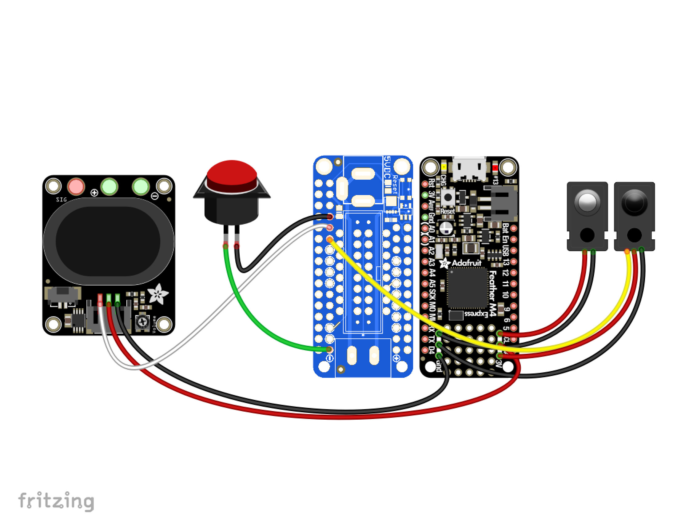

# LED Matrix Scoreboard
If you have ever played a basketball game at an arcade, this project is a perfect desktop version. I built an interative basketball hoop that will count your score every time you make a basket, it will then display your score on the backboard. The way this works is that there are sensors in the hoop that detect when a ball goes in, it then relays that information to the circuit which then makes the score go up.


| **Engineer** | **School** | **Area of Interest** | **Grade** |
|:--:|:--:|:--:|:--:|
| Braeden P | Sacred Heart Prep | Electrical Engineering | Rising Sophmore

<!--**Replace the BlueStamp logo below with an image of yourself and your completed project. Follow the guide [here](https://tomcam.github.io/least-github-pages/adding-images-github-pages-site.html) if you need help.**-->

<iframe src="https://drive.google.com/file/d/1Qb_cBo46hmILoujQ7SBQeim7MhqIJjBN/preview" width="640" height="480" allow="autoplay"></iframe>
  
# Final Milestone

<iframe width="560" height="315" src="https://www.youtube.com/embed/GilUcbJHTUQ?si=prKn_NBWJCFLiVs2" title="YouTube video player" frameborder="0" allow="accelerometer; autoplay; clipboard-write; encrypted-media; gyroscope; picture-in-picture; web-share" referrerpolicy="strict-origin-when-cross-origin" allowfullscreen></iframe>

This milestone finally marks the completion of my project. What I’ve accomplished since my previous milestone is that I calibrated the delay. The delay is read as time.sleep() with the delay in the parentheses and it is situated near the end of my main loop. The sensors now count all baskets made and the score doesn’t go up by more than two anymore.

My calibration routine was:
1. Check the score
2. If it went up by more than 2 increase delay
3. If it didn't sense decrease delay
4. Repeat steps 1-3

The biggest challenge I faced through this process was figuring out the code. It was very confusing to figure out what was wrong with the code because the developers of the project used the given code and it worked for them but not for me. My biggest triumph was figuring out this code. The triumph was that I had to make the line of code that counted the score into a string, a string is an array data structure. That and the delay in the code that I changed to make the sensors less sensitive. In the future, I hope to learn more about computers and the ideas behind code.

.png)

Figure 1: The figure above shows my calibration routine

# Second Milestone

<iframe width="560" height="315" src="https://www.youtube.com/embed/UzoG46Dgx08?si=HmRxoATlQNrEgput" title="YouTube video player" frameborder="0" allow="accelerometer; autoplay; clipboard-write; encrypted-media; gyroscope; picture-in-picture; web-share" referrerpolicy="strict-origin-when-cross-origin" allowfullscreen></iframe>

## Summary
Since my first milestone, I have worked on the software aspect of my project. There was a sample code that the developers of the project provided that I used, but some of the code didn’t work. I have been troubleshooting their code and I have made it functional, but there are some aspects that I want to change. For example, I need to change the delay so that the project will properly count the score. The purpose of the delay in this specific project is not to overload the feather with too much input from the sensor. It also controls the sensitivity of the sensor because while the delay is happening, the code isn’t running. So any input that the sensor receives while the code is stopped the feather will ignore. When I put the delay very low, for instance at 0.01, the score would start auto counting and go up eight with just one basket. This would happen because the delay in the code was less than the time it took for the ball to pass through the hoop. But when I put the delay higher, it wouldn’t detect the ball some of the time. This would happen because if the delay is high, the program does a lot of waiting. The state of the sensor isn’t constantly being checked, so if I were to make a basket in that state of waiting, it wouldn’t sense the ball go through. So I have to troubleshoot to find the perfect median between sensitive and not. 

.png)

Figure 2: The figure above is a finite state machine of my code.

## Challenges

This milestone has been challenging especially since my computer didn’t work with the software halfway through the process. For instance, it would keep giving me error codes saying that it couldn’t read information in a number of the files even though my computer worked perfectly with the files earlier in the process. The other problem I had which was my wires kept snapping still has been a problem throughout this problem. The project is at a point where every wire is either tinned or has a more sturdy solid core wire soldered onto it.

## Next Steps

I hope to finish troubleshooting my code by the end of the week so I can start working on modifications.

# First Milestone

<iframe width="560" height="315" src="https://www.youtube.com/embed/ktwYQZghSSA?si=WxeESJleusiH3-68" title="YouTube video player" frameborder="0" allow="accelerometer; autoplay; clipboard-write; encrypted-media; gyroscope; picture-in-picture; web-share" referrerpolicy="strict-origin-when-cross-origin" allowfullscreen></iframe>

## What My Project is

My project is a mini hoop with a scoreboard. It has sensors in the hoop that will detect when a ball goes through. The hoop will then make the score on the scoreboard go up by two just like basketball. It also has a button that starts a new game and resets the score. This milestone was mainly hardware, I put together the entire hoop and connected all the wires. I also soldered all of the parts together. Some things that I soldered were all the wires to the pins on the feather express and featherwing, and the wires connecting to the button. Every time a wire snapped I soldered a solid core wire onto the tip of it or I tinned it. There were also connectors that I soldered onto the featherwing and feather express so that the feather express could rest on top of the featherwing. 

.jpg)

Figure 3: The figure above is a picture of my project built and wired. The arrows point towards the most important parts of the project.


Figure 4: The figure above is a schematic of all the wiring that I did.

Figure Reference: Adafruit
## Challenges

The main challenge that I faced in building the hoop was the process of altering multiple mechanical aspects of my project for it to work. For instance, I used a dremel to sand down the acrylic covering of the matrix board because it was too big. I also had to reprint the legs of the hoop as they were too small. The biggest annoyance was that the wires kept snapping off of my circuit boards so I either soldered solid core wires onto them or tinned them. On top of all that, the matrix board that I have right now is broken so we have to get a new one. What came with this was a lot of debugging because I initially thought that something was wrong with my circuit board or my wiring. I ended up using a different, bigger, matrix board that was proven to work to hook everything up.

## Next Steps

The next step I want to take in my project is to get all of my software working. This is getting my sensors working, the button, and the speaker all to work. None of this is working right now and it is very frustrating so I hope to figure all of this out.

# Code

```c++
void setup() {
  // put your setup code here, to run once:
  Serial.begin(9600);
  Serial.println("Hello World!");
}

void loop() {
  // put your main code here, to run repeatedly:
# SPDX-FileCopyrightText: 2020 Liz Clark for Adafruit Industries
#
# SPDX-License-Identifier: MIT

import time
import board
import audioio
import audiomp3
import framebufferio
import rgbmatrix
import displayio
import adafruit_imageload
import digitalio
from adafruit_display_shapes.rect import Rect
from adafruit_bitmap_font import bitmap_font
from adafruit_display_text import label

#  matrix setup
displayio.release_displays()
matrix = rgbmatrix.RGBMatrix(
    width=64,
    height=32,
    bit_depth=4,
    rgb_pins=[board.D6, board.D5, board.D9, board.D11, board.D10, board.D12],
    addr_pins=[board.A5, board.A4, board.A3, board.A2],
    clock_pin=board.D13,
    latch_pin=board.D0,
    output_enable_pin=board.D1,
)
display = framebufferio.FramebufferDisplay(matrix)

#  display groups
start_group = displayio.Group()
score_group = displayio.Group()

#  text & bg color setup for scoreboard
score_text = "      "
font = bitmap_font.load_font("/Fixedsys-32.bdf")
yellow = (255, 215, 0)
navy = 0x000080

score_text = label.Label(font, text=score_text, color=0x0)
score_text.x = 23
score_text.y = 15

score_bg = Rect(0, 0, 64, 32, fill=yellow, outline=navy, stroke=3)

#  start splash screen graphic
start, start_pal = adafruit_imageload.load("/pixelHoops.bmp",
                                           bitmap=displayio.Bitmap,
                                           palette=displayio.Palette)

start_grid = displayio.TileGrid(start, pixel_shader=start_pal,
                                width=64, height=32)
#  adding graphics to display groups
start_group.append(start_grid)
score_group.append(score_bg)
score_group.append(score_text)

#  start by showing start splash
display.root_group = start_group

#  setup for break beam LED pin
break_beam = digitalio.DigitalInOut(board.A1)
break_beam.direction = digitalio.Direction.INPUT
break_beam.pull = digitalio.Pull.UP

#  setup for button pin
button = digitalio.DigitalInOut(board.D4)
button.direction = digitalio.Direction.INPUT
button.pull = digitalio.Pull.UP

#  setup for speaker pin
speaker = audioio.AudioOut(board.A0)

#  mp3 decoder setup
file = "/hoopBloop0.mp3"
mp3stream = audiomp3.MP3Decoder(open(file, "rb"))

#  state machines used in the loop
score = 0
hoops = False
button_state = False
beam_state = False
sample = 0

while True:
    #  button debouncing
    if not button.value and not button_state:
        button_state = True
    #  debouncing for break beam LED
    if not break_beam.value and not beam_state:
        beam_state = True
    #  if a game hasn't started and you press the button:
    if not button.value and not hoops:
        #  game starts
        hoops = True
        button_state = False
        #  display shows scoreboard
        display.root_group = score_group
        print("start game!")
        time.sleep(0.1)
    if hoops:
        #  if the break beam LED detects a hoop:
        if not break_beam.value and beam_state:
            #  score increase by 2 points
            print(break_beam.value)
            print(score)
            score += 2
            #  an mp3 plays
            file = "/hoopBloop{}.mp3".format(sample)
            mp3stream.file = open(file, "rb")
            speaker.play(mp3stream)
            print("score!")
            #  resets break beam
            beam_state = False
            #  increases mp3 file count
            #  plays the 3 files in order
            sample = (sample + 1) % 3
        #  score text x pos if 4 digit score
        if score >= 1000:
            score_text.x = -1
        #  score text x pos if 3 digit score
        elif score >= 100:
            score_text.x = 7
        #  score text x pos if 2 digit score
        elif score >= 10:
            score_text.x = 16
        elif score >= 0:
            score_text.x = 23
        #  updates score text to show current score
        score_text.text = str(score)
        time.sleep(0.1556486497655)
    #  if a game is in progress and you press the button:
    if not button.value and hoops:
        #  game stops
        hoops = False
        button_state = False
        #  score is reset to 0
        score = 0
        score_text.text = str(score)
        #  display shows the start splash graphic
        display.root_group = start_group
        print("end game!")
        time.sleep(0.5)

}
```

# Bill of Materials
Here's where you'll list the parts in your project. To add more rows, just copy and paste the example rows below.
Don't forget to place the link of where to buy each component inside the quotation marks in the corresponding row after href =. Follow the guide [here]([url](https://www.markdownguide.org/extended-syntax/)) to learn how to customize this to your project needs. 

| **Part** | **Note** | **Price** | **Link** |
|:--:|:--:|:--:|:--:|
| Adafruit Feather M4 Express | This part holds all the code | $22.95 | [Link](https://www.adafruit.com/product/3857) |
| Adafruit RGB Matrix Featherwing Kit | This part controls the RGB matrix board | $7.50 | [Link](https://www.adafruit.com/product/3036) |
| 64x32 RGB LED Matrix - 4mm pitch | This is the display of the project | $39.95 | [Link](https://www.adafruit.com/product/2278) |
| Adafruit STEMMA Speaker | This part plays the sound when you make a basket | $5.95 | [Link](https://www.adafruit.com/product/3885) |
| Mini LED Arcade Button - 24mm Translucent Clear | This part starts and resets games | $2.50 | [Link](https://www.adafruit.com/product/3429) |
| IR Break Beam Sensor - 5mm LEDs | This part senses if you make a basket | $5.95 | [Link](https://www.adafruit.com/product/2168) |
| JST PH 2-Pin Cable - Female Connector 100mm | This is a connecter | $0.75 | [Link](https://www.adafruit.com/product/261) |
| JST PH 2-Pin Cable – Male Header 200mm | This is a connecter | $0.95 | [Link](https://www.adafruit.com/product/3885) |
| STEMMA JST PH 2mm 3-Pin to Female Socket Cable - 200mm | This is a connecter | $1.25 | [Link](https://www.adafruit.com/product/3894) |
| Silicone Cover Stranded-Core Ribbon Cable - 10 Wire 1 Meter Long | This is a connecter | $3.95 | [Link](https://www.adafruit.com/product/3890) |
| Header Kit for Feather - 12-pin and 16-pin Female Header Set | This part goes onto the feather to connect it to the featherwing | $0.95 | [Link](https://www.adafruit.com/product/2886) |
| Black Nylon Machine Screw and Stand-off Set – M2.5 Thread | These are screws to connect things | $16.95 | [Link](https://www.adafruit.com/product/3299) |
| 5V 4A (4000mA) switching power supply - UL Listed | This is the power supply | $14.95 | [Link](https://www.adafruit.com/product/1466) |


# Starter Project: Calculator
<iframe width="560" height="315" src="https://www.youtube.com/embed/Lc4bP4zvc5Q?si=o-6FkkPM0eynmOZC" title="YouTube video player" frameborder="0" allow="accelerometer; autoplay; clipboard-write; encrypted-media; gyroscope; picture-in-picture; web-share" referrerpolicy="strict-origin-when-cross-origin" allowfullscreen></iframe>

[Link to my Starter Project](https://www.amazon.com/Kit-Calculator-Resistance-Electronic-HUAGZIMO/dp/B0D13C9SYT/ref=sr_1_3?crid=3HGJTLNZ9O2GX&dib=eyJ2IjoiMSJ9._SWtzcdxglPoBR9j02Ru8HdkQYctYGhXoQSzf1MVwW8-wdJNSkQkLmCAtn4dRp6g-6R7J9461vhIP2EF_nk7Tig6XDG9bCrlMTSlmck5MBQwLRhhnSiQUGo0QJa1GwgSj6a6-1yBKFqneN2-Z0AqO-StnMGL2G8655x5qfsjKhjBt48dYiTRy3_0E2_Jk5agtyEMTLExRFtYVrPI5ML2CKLPh8c4dT4clp-o5in2kS0.ajrpXguZyLba8zZbq_b1WT_1ccEQlOe_PpesP9bkSUM&dib_tag=se&keywords=calculator+solder&qid=1717994208&sprefix=calculator+solde%2Caps%2C148&sr=8-3)

## Summary
I chose the calculator for my starter project because I wanted something that I will actually use and have an everyday use for. The way it works is that there is the integrated circuit, or IC, which performs all the calculations. The IC receives the input from the buttons when the buttons are pushed because the button closes a switch, which connects the circuit providing voltage to the IC. When the buttons are in their unpushed position, the switch is open so there is no current between the battery and the IC, but when the button is pushed, it closes the switch onto the circuit which connects a current with voltage to the IC. A switch is an electrical component that disrupts the current in a wire. The IC then displays the number then finished calculation on the seven segment display. The assembly process was pretty simple, the majority of the building process was soldering.


Figure 5: The figure above shows how switches function on an electrical circuit. The left shows an open switch and the right shows a closed switch, so the left would be an unpushed button and the right would be a pushed button. The difference between the two is that the left is an open circuit and the right is a closed circuit which means that the right can provide current to the light to light it up while the left can not.

Figure Reference: Research Gate
## Components Used

- Monolithic Capacitor
- CR2032 Battery
- CR2032 Battery Socket
- Black-Yellow Button
- White Button Cap
- Transparent Button Cap
- Micro USB Socket
- 3Bit Digital Tube
- STC15W408AS Controller
- IC Socket
- Button Labels
- Acrylic Board
- M2*2*+3mm Copper Pillar Screw
- M2*20mm Screw
- M2*4mm Screw
- M2 Nut
- PCB Circuit Board

## Challenges

Some challenges I faced were soldering and putting the case on. Soldering was somewhat challenging due to the fact that the majority of the project was soldering and some parts were small which made it harder to be precise while keeping the project clean. Another challenge I faced was the case. In the beginning of putting the case on, the battery didn’t fully fit into the slot and the charger didn’t fit into the slot for the charger.

## Next Steps

I am very excited to start on my main project and to see what I can learn from it.

<!--# Other Resources/Examples
One of the best parts about Github is that you can view how other people set up their own work. Here are some past BSE portfolios that are awesome examples. You can view how they set up their portfolio, and you can view their index.md files to understand how they implemented different portfolio components.
- [Example 1](https://trashytuber.github.io/YimingJiaBlueStamp/)
- [Example 2](https://sviatil0.github.io/Sviatoslav_BSE/)
- [Example 3](https://arneshkumar.github.io/arneshbluestamp/)

To watch the BSE tutorial on how to create a portfolio, click here.-->
